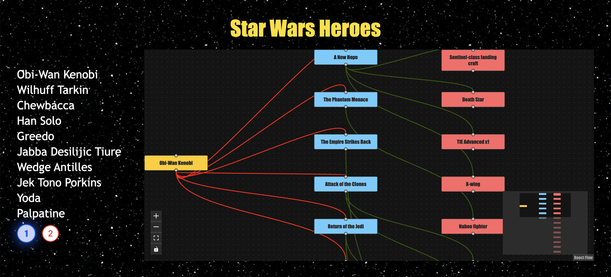

**DEMO LINK:**
https://david-shahmatov006.github.io/StarNavi_TT/

**:fire:STARNAVI TEST TASK:fire:**
In this web application you can see detailed information about the star wars hero in the form of a graph (in which film he appeared, and what spaceships were used in this film). Since the number of heroes is not small, pagination is implemented in this application. You can also move the nodes of the graph.

**TECHNOLOGIES STACK:**
- REACT
- REACT FLOW
- SASS
- TYPESCRIPT
- REACT HOOKS
- BABEL
- JEST

**PREVIEW:**

**SEE YOU ON THE INTERVIEW :wink:**